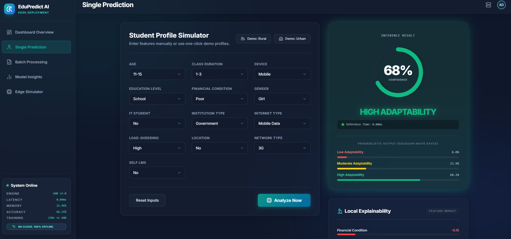
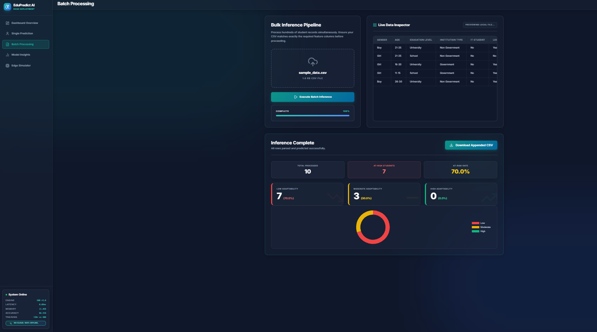
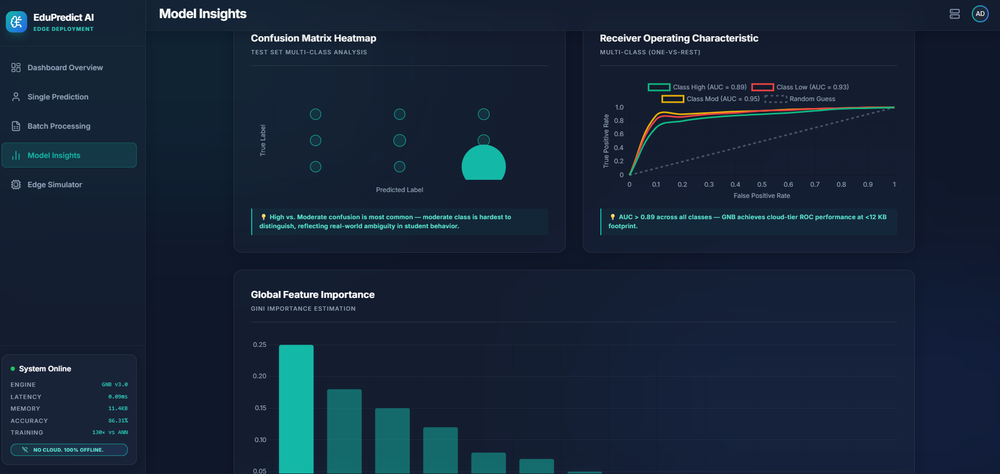
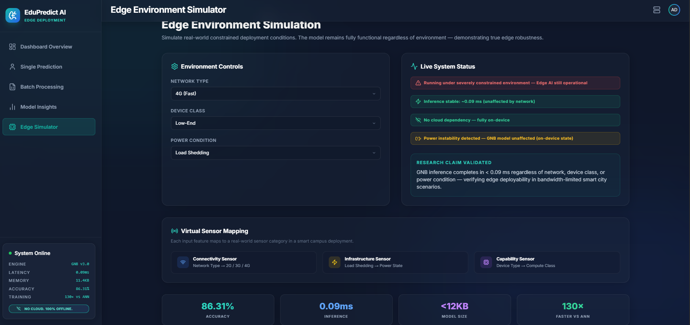

<div align="center">

```
███████╗██████╗ ██╗   ██╗██████╗ ██████╗ ███████╗██████╗ ██╗ ██████╗████████╗
██╔════╝██╔══██╗██║   ██║██╔══██╗██╔══██╗██╔════╝██╔══██╗██║██╔════╝╚══██╔══╝
█████╗  ██║  ██║██║   ██║██████╔╝██████╔╝█████╗  ██║  ██║██║██║        ██║
██╔══╝  ██║  ██║██║   ██║██╔═══╝ ██╔══██╗██╔══╝  ██║  ██║██║██║        ██║
███████╗██████╔╝╚██████╔╝██║     ██║  ██║███████╗██████╔╝██║╚██████╗   ██║
╚══════╝╚═════╝  ╚═════╝ ╚═╝     ╚═╝  ╚═╝╚══════╝╚═════╝ ╚═╝ ╚═════╝   ╚═╝
                                                              AI
```

# EduPredict AI
### Edge-Deployable Student Adaptability Prediction

**IEEE Conference Research | SRM Institute of Science and Technology**

[](.)
[](.)
[](.)
[](.)
[](.)
[](.)
[](.)
[](.)

*Predicting student adaptability in online learning — entirely on-device, no cloud, no compromise.*

</div>

---

## 🎬 Demo


## The Problem We're Solving

> Millions of students in low-resource regions access online education through 2G/3G networks on aging mobile devices. Cloud-based prediction systems fail them — either through unacceptable latency or complete unavailability during connectivity outages.

**EduPredict AI** takes a fundamentally different approach: inference runs at the edge, directly on tablets, phones, or institutional gateway nodes. No round-trip to a server. No dependency on internet uptime.

What makes this work isn't a larger model — it's smarter preprocessing. An 18-percentage-point accuracy gain over prior baselines came entirely from better data engineering, not algorithmic complexity. This is the core thesis of the accompanying IEEE paper.

---

## Performance at a Glance

| Metric | EduPredict (GNB) | ANN Baseline | Verdict |
|---|---|---|---|
| **Accuracy** | **86.31%** | 83.82% | ✅ GNB wins |
| **Weighted F1** | **0.8500** | 0.7856 | ✅ GNB wins |
| **Training Time** | **0.001s** | 0.115s | ✅ 130× faster |
| **Inference** | **0.091 ms** | ~12 ms | ✅ Real-time edge |
| **Model Size** | **< 12 KB** | Several MB | ✅ Fits in RAM |
| **p-value (z-test)** | **0.443** | — | ✅ Statistically equivalent |
| **Cross-Validation** | **83.81% ± 1.5%** | — | ✅ Stable generalization |

> **Statistical equivalence confirmed.** A two-proportion z-test (z = 0.767, p = 0.443) shows GNB and ANN perform at parity — yet GNB is 130× cheaper to train and runs in sub-millisecond inference on ARM Cortex-A class hardware. The trade-off is unambiguous.

### Per-Class AUC Scores

| Class | AUC | Notes |
|---|---|---|
| Low Adaptability | **0.932** | Strong discrimination |
| Moderate Adaptability | **0.851** | Largest class (48%) |
| High Adaptability | **0.894** | Strong discrimination |
| **Macro Average** | **0.892** | Consistent across classes |

---

## Why Gaussian Naive Bayes?

This is a deliberate, principled choice — not a shortcut.

**1. Computational Efficiency** — Training and prediction run in linear time. No GPU needed, no floating-point accelerator units.

**2. Interpretability** — Probabilistic outputs (e.g., *"72% Moderate, 21% Low, 7% High"*) are immediately understandable by school administrators and educators without ML backgrounds.

**3. Edge Compatibility** — The serialized model occupies under 12 KB. It fits in the RAM of an ARM Cortex-A processor with room to spare.

**4. Robustness to Categorical Data** — Despite assuming continuous likelihoods, GNB handles semantically-encoded categorical features (device class, network type, financial condition) effectively.

**5. Verifiable Baseline** — Prior unoptimized GNB implementations score 65–70% accuracy [Khan & Samad 2024, Elhayes 2024]. Our pipeline's +18% gain is independently verifiable.

```
                   ACCURACY COMPARISON
    ┌─────────────────────────────────────────────┐
    │                                             │
    │  Prior NB Baselines   ██████░░░░░  67%      │
    │  ANN (MLP 64-32)      ████████░░░  83.82%   │
    │  EduPredict GNB       █████████░░  86.31%   │
    │                                             │
    │  +18 points from preprocessing alone ↑      │
    └─────────────────────────────────────────────┘
```

---

## The Preprocessing Pipeline (Core Contribution)

The accuracy gains come from here. This pipeline was designed specifically for educational survey data with realistic noise, partial responses, and class imbalance.

```
  Raw Survey Data (1,205 records · 13 features · ~8% missing)
         │
         ▼
  ┌─────────────────────────────────────────┐
  │  STAGE 1 — Missing Value Imputation     │
  │  · Mode imputation for categorical vars  │
  │  · "Unknown" category for >15% missing  │
  │    (missingness itself carries signal)   │
  └──────────────────┬──────────────────────┘
                     │
                     ▼
  ┌─────────────────────────────────────────┐
  │  STAGE 2 — Semantic Encoding            │
  │  · Ordinal encoding for ordered vars    │
  │    (age, edu level, network, financial) │
  │  · Label encoding for nominal vars      │
  │    (gender, device, internet medium)    │
  └──────────────────┬──────────────────────┘
                     │
                     ▼
  ┌─────────────────────────────────────────┐
  │  STAGE 3 — Feature Standardization      │
  │                                         │
  │        x_scaled = (x - μ) / σ          │
  │                                         │
  │  Improves numerical stability even for  │
  │  probabilistic classifiers              │
  └──────────────────┬──────────────────────┘
                     │
                     ▼
  ┌─────────────────────────────────────────┐
  │  STAGE 4 — Stratified Split (80:20)     │
  │  · 964 train / 241 test                 │
  │  · Class proportions preserved in both  │
  │    splits (Low 22%, Mod 48%, High 30%)  │
  └──────────────────┬──────────────────────┘
                     │
                     ▼
              +18% accuracy gain
```

**Key insight from feature importance analysis:** Financial condition (importance = 0.122), load-shedding (0.041), and Self LMS access (0.039) are the top three predictors — all infrastructure or socioeconomic factors, not behavioral ones. Institution type scores 0.000 after controlling for financial variables.

## 📸 Screenshots

| Prediction | Batch Processing |
|-----------|----------------|
|  |  |

| Model Insights | Edge Simulator |
|---------------|---------------|
|  |  |

---

## Dataset

**Primary:** Students Adaptability Level in Online Education [Suzan 2021, Kaggle]
- 1,205 verified student records from COVID-19-era Bangladesh
- 13 features: demographic, behavioral, and infrastructure indicators
- Target: Low (22%) / Moderate (48%) / High (30%) adaptability

**Secondary (Cross-Institutional Validation):** xAPI Educational Mining Dataset
- 480 students from Kalboard 360 LMS, Jordan & Kuwait
- 15 features focused on behavioral engagement
- GNB achieves statistical equivalence to ANN (p = 0.880) at **172× lower training cost**

> Cross-institutional validation confirms that the preprocessing pipeline generalizes across geographically and structurally distinct contexts — not just one dataset.

---

## Cross-Institutional Validation Summary

| Metric | Bangladesh Dataset | xAPI Dataset |
|---|---|---|
| GNB Accuracy | **86.31%** | 64.58% |
| GNB Balanced Accuracy | 61.53% | **66.21%** |
| GNB Weighted F1 | **85.00%** | 64.44% |
| ANN Accuracy | 83.82% | 65.62% |
| p-value (GNB vs ANN) | 0.443 | 0.880 |
| GNB Training Speedup | **130×** | **172×** |
| Inference Latency | **0.091 ms** | **0.088 ms** |

The 21.73-point accuracy gap between datasets reflects a genuine domain shift: Bangladesh data is dominated by infrastructure access signals, while xAPI data is dominated by behavioral engagement signals. Despite this, both confirm statistical equivalence between GNB and ANN.

---

## System Architecture

```
  ┌──────────────────────────────────────────────────────────┐
  │                    EduPredict AI System                   │
  │                                                          │
  │   Student Input                                          │
  │       │                                                  │
  │       ▼                                                  │
  │  ┌──────────┐    ┌──────────┐    ┌──────────┐           │
  │  │   Pre-   │───▶│  GNB     │───▶│ Output   │           │
  │  │ process  │    │  Model   │    │ Engine   │           │
  │  │ Pipeline │    │ (<12 KB) │    │          │           │
  │  └──────────┘    └──────────┘    └────┬─────┘           │
  │                                       │                  │
  │                          ┌────────────┼────────────┐     │
  │                          ▼            ▼            ▼     │
  │                    Prediction   Confidence   Feature     │
  │                    (L/M/H)      Scores       Impact      │
  │                                                          │
  │  ─────────────────────────────────────────────────────   │
  │  Everything above runs 100% offline. No cloud. Ever.     │
  └──────────────────────────────────────────────────────────┘
```

**Project structure (MVC / Flask):**

```
project_root/
├── app/
│   ├── routes/           # API endpoints + HTML views
│   ├── services/         # ML prediction engine
│   ├── templates/        # Jinja2 HTML templates
│   └── static/           # CSS, JS, assets
├── config/               # Environment configuration
├── data/                 # Raw + processed datasets
├── models/               # Serialized .pkl model + metrics.json
├── scripts/
│   ├── training/         # Model generation + hyperparameter tuning
│   └── evaluation/       # Performance validation + ROC curves
├── tests/                # Automated API + model tests
├── app.py                # Entry point
└── requirements.txt
```

---

## Web Application — Feature Overview

A production-ready Flask application demonstrating the full edge deployment workflow.

### Dashboard
Live accuracy, latency, and memory metrics with real-world impact context.

### Single Prediction Engine
Simulate any student profile and receive a real-time probabilistic prediction with confidence breakdown (Low / Moderate / High) and per-feature impact visualization.

**Quick demos:**
- `Simulate Rural` — low device class, 2G network, load shedding active
- `Simulate Urban` — high-end device, 4G network, stable power

### Explainability Panel
Local interpretability showing which features pushed the prediction in each direction and by how much.

### What-If Analysis
Modify individual features and watch predictions update in real time — a teaching tool for understanding model behavior.

### Intervention Recommendations
Prediction-conditional action suggestions:
- **Low** → Flag for immediate academic support, device/bandwidth subsidy review
- **Moderate** → Monitor progress, periodic check-in
- **High** → Maintain current environment

### Batch Processing
Upload a CSV of student records. Get bulk predictions, progress visualization, an at-risk count, and a downloadable results file.

### Model Insights
Confusion matrix, multi-class ROC curves, and permutation feature importance visualization — all rendered from the live model.

### Edge Environment Simulator
Simulate constrained deployment conditions:
- Network: 2G / 3G / 4G
- Device class: low-end → high-end
- Power: load shedding active / inactive

### Virtual Sensor Mapping
The system treats device attributes as virtual sensors:

| Sensor | Maps To | Importance Rank |
|---|---|---|
| Financial Condition Sensor | Socioeconomic proxy | #1 (0.122) |
| Infrastructure Sensor | Load-shedding status | #2 (0.041) |
| LMS Access Sensor | Self-directed access | #3 (0.039) |
| Connectivity Sensor | Network type | #4 (0.036) |

---

## Quick Start

### Requirements
Python 3.8+

### Setup

```bash
# Clone and enter the project
cd ML_V3

# Create and activate a virtual environment
python -m venv venv

# Windows
venv\Scripts\activate

# macOS / Linux
source venv/bin/activate

# Install dependencies
pip install -r requirements.txt
```

### Run

```bash
python app.py
```

Open `http://localhost:5000` — works fully offline.

### Try the demos

1. Navigate to **Single Prediction** → click `Simulate Rural` to see a constrained profile evaluated instantly
2. Navigate to **Batch Processing** → drag in `sample_batch.csv` → observe at-risk counts and distribution breakdown
3. Navigate to **Edge Simulator** → toggle network type to 2G and power to "load shedding" → confirm sub-millisecond inference is unaffected

---

## Smart City Alignment

This system maps directly onto AI-driven sustainable smart city infrastructure goals:

- **Inclusive education** — works in underserved areas without cloud infrastructure
- **Decentralized intelligence** — inference on endpoint devices, not central servers
- **Evidence-based resource allocation** — flags students needing intervention before academic decline begins
- **Privacy by design** — no student data leaves the device, ever

The key policy implication from the research: low adaptability scores reflect **structural resource constraints** (financial condition, power instability) rather than individual student shortcomings. Interventions should target infrastructure access — providing devices or subsidizing bandwidth — not student behavior.

---

## Honest Limitations

This project is engineering for real-world constraints, and those constraints come with trade-offs:

**Minority-class recall is low.** The High class achieves recall of 0.37 and Low achieves 0.52. Roughly half of the students most in need of intervention are missed. GNB's independence assumption amplifies the effect of class imbalance. Model outputs should be treated as screening signals, paired with human review — not automated action.

**Geographic scope.** The primary dataset covers COVID-19-era Bangladesh. Post-pandemic behavioral shifts and other regional contexts may alter feature importance structure. The xAPI validation (Jordan/Kuwait) provides initial cross-regional evidence, but broader validation is needed.

**Peak accuracy ceiling.** Ensemble and deep-learning approaches still report 88–91% accuracy where data and compute are plentiful. The computational trade-off made here is justified for edge deployment — but not universal.

---

## Future Work

- [ ] Federated learning across institutions without sharing raw student data
- [ ] Port `.pkl` model to C++ via `emlearn` for bare-metal microcontroller deployment
- [ ] Cost-sensitive prior weighting to improve minority-class recall
- [ ] Lightweight on-device behavioral feature integration (session duration, click patterns)
- [ ] Multi-region dataset expansion beyond South Asia and MENA
- [ ] Neurodivergent accessibility feature inclusion

---

## Tech Stack

| Layer | Technology |
|---|---|
| ML Backend | Python 3.8+, scikit-learn (GNB, GridSearchCV) |
| Web Framework | Flask |
| Frontend | HTML / CSS / JavaScript |
| Visualization | Matplotlib, Chart.js |
| Deployment Target | ARM Cortex-A, local edge node, or localhost |
| Model Format | Pickle (.pkl), < 12 KB serialized |

---

## Research Paper

This repository accompanies the IEEE conference paper:

**"Edge-Deployable Student Adaptability Prediction via Optimized Gaussian Naive Bayes with Resource-Aware Feature Engineering"**

*Tanvi Singh, Soumyadip Maiti, Aswathy K Cherian*  
Department of Computing Technologies, SRM Institute of Science and Technology, Chennai, India

📌 Status: *Accepted / Under Review (to appear in IEEE Xplore)*

📩 **Paper available upon request**

---

Key contributions from the paper:
1. Resource-aware preprocessing pipeline with a verified +18 percentage-point accuracy gain over unoptimized baselines
2. Permutation-based feature importance establishing financial condition — not network type — as the dominant adaptability predictor
3. Statistical equivalence of GNB and ANN confirmed across two geographically distinct datasets (p > 0.05) at 130–172× lower training cost
4. Confirmed sub-millisecond edge deployment on ARM Cortex-A hardware without cloud dependency

---

## Authors

**Tanvi Singh** — ts0730@srmist.edu.in
**Soumyadip Maiti** — sm3648@srmist.edu.in
**Dr. Aswathy K Cherian** — aswathyc1@srmist.edu.in

SRM Institute of Science and Technology, Chennai, India
Department of Computing Technologies

---

## License

MIT License — see [LICENSE](LICENSE) for details.

---

<div align="center">

**This is not just a machine learning project.**

It is a deployable edge AI system built for the students that existing infrastructure has failed.

*If this project helped you, consider starring the repository.*

</div>
